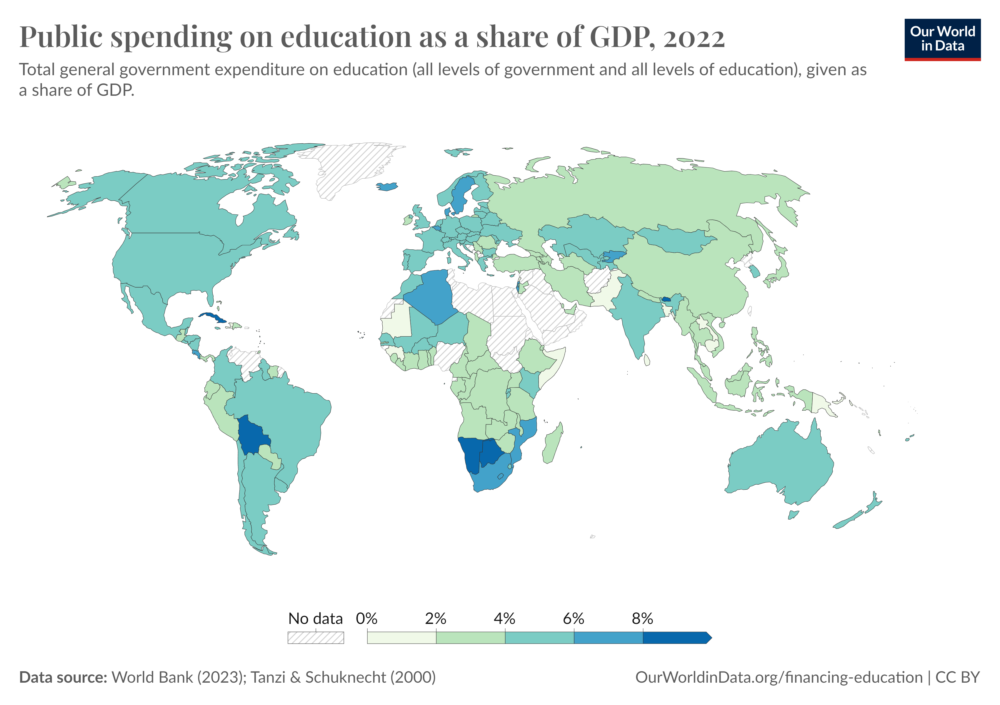

## Exploratory Data Analysis of Nation GDP per capita, Life-Expectancies and Education Expenditure

This report serves to visualize and detail distributions of global GDP per capitas, Life-Expectancies, and Education Expenditure.

The relationship between GDP per capita and Life-Expectancy will be explored, as well as nation's expenditure on education as a proportion of total GDP.

The data used throughout this study is drawn from World Development Indicators @worldbank2022.

### GDP per capita

The **GDP per capita** for the 203 countries in the dataset exhibits a wide range, reflecting significant disparities in economic prosperity across the world. The mean GDP per capita is approximately **\$20,345.71**, with a standard deviation of **\$31,308.94**, indicating substantial variability among countries.

::: {.cell execution_count=2}

::: {.cell-output .cell-output-display}
{#fig-gdp-histogram}
:::
:::


More Key Statistics:

- **Minimum GDP per Capita:** \$259.03
- **Maximum GDP per Capita:** \$240,862.18
- **Median (50th percentile):** \$7,587.59
- **25th percentile:** \$2,570.56
- **75th percentile:** \$25,982.63

The median GDP per capita is significantly lower than the mean, suggesting a right-skewed distribution where a small number of countries have very high GDP per capita values, elevating the average. We observe this skew in @fig-gdp-histogram, above. The majority of countries have GDP per capita values clustered between the 25th and 75th percentiles (\$2,570.56 to \$25,982.63).

::: {#gdp-summary-stats .cell execution_count=3}
``` {.python .cell-code}
gdp_per_capita_stats = data['gdp_per_capita'].describe()
print("GDP per Capita Statistics:")
print(gdp_per_capita_stats)
```

::: {.cell-output .cell-output-stdout}
```
GDP per Capita Statistics:
count       203.000000
mean      20345.707649
std       31308.942225
min         259.025031
25%        2570.563284
50%        7587.588173
75%       25982.630050
max      240862.182448
Name: gdp_per_capita, dtype: float64
```
:::
:::


### Life Expectancy

The **Life Expectancy** data for 209 countries shows a global average of **72.42 years**, with a standard deviation of **7.71 years**, indicating moderate variation across countries.

::: {.cell execution_count=4}

::: {.cell-output .cell-output-display}
{#fig-life-expectancy-histogram}
:::
:::


More Key Statistics:

- **Minimum Life Expectancy:** 52.997 years
- **Maximum Life Expectancy:** 85.377 years
- **Median (50th percentile):** 73.51 years
- **25th percentile:** 66.78 years
- **75th percentile:** 78.475 years

The median life expectancy is slightly higher than the mean, suggesting a relatively symmetrical distribution, which we can observe in the figure above, @fig-life-expectancy-histogram. The interquartile range (66.78 to 78.475 years) captures the middle 50% of countries, highlighting that most countries have life expectancies within this range. The gap between the minimum and maximum values underscores significant differences in health outcomes and living conditions worldwide.

The scatter plot in Figure @fig-gdp-life presents the relationship between GDP per capita and life expectancy across various countries in 2022. An analysis of this graph reveals several important insights. Observe a positive correlation between GDP per capita and life expectancy, as well as 'diminishing returns' as GDP per capita increases. This indicates that GDP per capita is less related to life expectancy for countries as GDP per capita increases.

::: {.cell execution_count=5}

::: {.cell-output .cell-output-display}
{#fig-gdp-life}
:::
:::


::: {#life-expectancy-summary-stats .cell execution_count=6}
``` {.python .cell-code}
life_expectancy_stats = data['life_expectancy'].describe()
print("\nLife Expectancy Statistics:")
print(life_expectancy_stats)
```

::: {.cell-output .cell-output-stdout}
```

Life Expectancy Statistics:
count    209.000000
mean      72.416519
std        7.713322
min       52.997000
25%       66.782000
50%       73.514634
75%       78.475000
max       85.377000
Name: life_expectancy, dtype: float64
```
:::
:::


### Education Expenditure (% of GDP)

For Education Expenditure as a percentage of GDP, data is available for 105 countries. The mean expenditure is 4.23% of GDP, with a standard deviation of 2.07%, reflecting variability in national investment in education.

::: {.cell execution_count=7}

::: {.cell-output .cell-output-display}
{#fig-education-expenditure-histogram}
:::
:::


More Key Statistics:

- Minimum Education Expenditure: 1.027%
- Maximum Education Expenditure: 16.582%
- Median (50th percentile): 3.887%
- 25th percentile: 2.898%
- 75th percentile: 5.156%

The median expenditure is slightly below the mean, indicating a slight left-skew in the distribution, which we can again observe above, in @fig-education-expenditure-histogram. The majority of countries spend between approximately 2.90% and 5.16% of their GDP on education. The maximum value of 16.58% suggests that some countries prioritize education significantly more than others relative to their economic output. Below Figure @fig-education-expenditure displays the 10 countries with the highest expenditure on education as a percentage of GDP.

::: {.cell execution_count=8}

::: {.cell-output .cell-output-display}
{#fig-education-expenditure}
:::
:::


Another visual of education expenditure as a percentage of GDP from @ourworldindata_education2023:

{ align="center" }

::: {#education-expenditure-summary-stats .cell execution_count=9}
``` {.python .cell-code}
education_expenditure_stats = data['education_expenditure_gdp_share'].describe()
print("\nEducation Expenditure (% of GDP) Statistics:")
print(education_expenditure_stats)
```

::: {.cell-output .cell-output-stdout}
```

Education Expenditure (% of GDP) Statistics:
count    105.000000
mean       4.226215
std        2.069486
min        1.027000
25%        2.898000
50%        3.887000
75%        5.156000
max       16.582462
Name: education_expenditure_gdp_share, dtype: float64
```
:::
:::


## Takeaways

### Revisiting Summary Statistics

::: {#tbl-key-stats .cell tbl-cap='Table 1: Key Statistics of Selected Indicators.' execution_count=10}

::: {.cell-output .cell-output-stdout}
```
       gdp_per_capita  life_expectancy  education_expenditure_gdp_share
count          203.00           209.00                           105.00
mean         20345.71            72.42                             4.23
std          31308.94             7.71                             2.07
min            259.03            53.00                             1.03
25%           2570.56            66.78                             2.90
50%           7587.59            73.51                             3.89
75%          25982.63            78.47                             5.16
max         240862.18            85.38                            16.58
```
:::
:::


### McKinsey's Analysis "Pixel's of Progress: Chapter 3"

Our analysis of the relationship between **GDP per capita** and **life expectancy** in Figure @fig-gdp-life reveals a positive correlation, indicating that higher economic prosperity generally leads to better health outcomes. However, we also observed diminishing returns at higher GDP levels and significant variability among countries with similar economic standings. This suggests that factors beyond mere economic wealth—such as healthcare infrastructure, education quality, and social policies—play crucial roles in determining life expectancy.

McKinsey Global Institute's "Pixels of Progress: Chapter 3" @mckinsey2023pixels echoes these findings by exploring how advancements in various sectors contribute to human development beyond traditional economic metrics. The article emphasizes that while economic growth is essential, it is not sufficient on its own to ensure improved life expectancy and overall well-being. Investments in **healthcare access**, **education**, and **technological innovation** are highlighted as critical drivers of progress.

